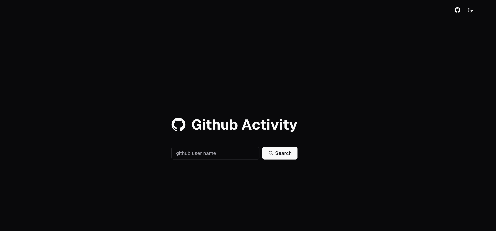
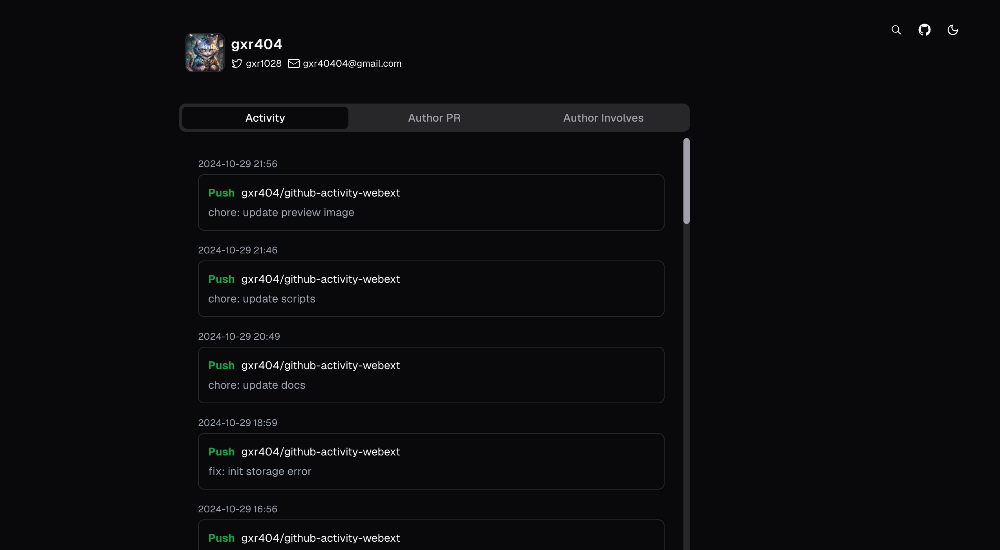

# github-activity

Optimize the display of recent activities of GitHub users


## Preview

[Live Demo](https://github-activity-one.vercel.app/)





## Recommend

Collaborating with [github-activity-webext](https://github.com/gxr404/github-activity-webext) browser extension for a better user experience

## Getting Started

First, run the development server:

```bash
npm run dev
# or
yarn dev
# or
pnpm dev
# or
bun dev
```

## Deploy on Vercel

[](https://vercel.com/new/clone?repository-url=https%3A%2F%2Fgithub.com%2Fgxr404%2Fgithub-activity&env=GITHUB_TOKEN&project-name=github-activity&repository-name=github-activity)

### Environment Variables

1. [Create Token](https://github.com/settings/tokens?type=beta)
2. write `.env` file

    ```env
    GITHUB_TOKEN=YOUR_GITHUB_TOKEN
    ```
